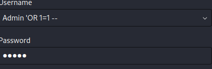

#  OWASP Juice Shop – SQL Injection (Admin Login Bypass)
##  Objective
Exploit a SQL Injection vulnerability in the login functionality to gain unauthorized access as an administrator.

---

##  Vulnerability Description
The login form in OWASP Juice Shop is vulnerable to **SQL Injection**, allowing attackers to manipulate backend SQL queries through unsanitized user input.

This flaw enables authentication bypass without valid credentials.

---

##  Affected Component
- Login form (`/rest/user/login`)
- Backend SQL query handling user authentication

---

##  Payload Used

```sql
' OR 1=1 --
````

---

##  Exploitation Steps

### 1. Navigate to Login Page

Access the Juice Shop login interface.

---

### 2. Inject Malicious Payload

| Field    | Input         |
| -------- | ------------- |
| Email    | `' OR 1=1 --` |
| Password | `anything`    |

i have attached a screenshot of the same below

---

### 3. Interpreted SQL Query

```sql
SELECT * FROM users 
WHERE email = '' OR 1=1 -- ' 
AND password = 'anything';
```

---

### 4. Explanation

* `'` → Terminates the email string
* `OR 1=1` → Always evaluates to TRUE
* `--` → Comments out the rest of the query (including password check)

Final condition becomes:

```sql
WHERE TRUE
```

---

### 5. Result

* Authentication is bypassed
* Application logs in as the first user in the database
* Typically results in **administrator access**

---

##  Root Cause

* Unsanitized user input directly embedded in SQL queries
* Lack of parameterized queries (prepared statements)
* No proper input validation

---

## Mitigation

### Use Parameterized Queries

**Example (Node.js):**

```javascript
db.query("SELECT * FROM users WHERE email = ? AND password = ?", [email, password]);
```

---

### Input Validation

* Reject or sanitize special characters (`'`, `--`, `;`)
* Use allowlists where possible

## Severity

**High / Critical**

---

##  OWASP Classification

* OWASP Top 10: **A05:2025 -Injection**

---

##  Conclusion

The application is vulnerable to SQL Injection in the login functionality, allowing attackers to bypass authentication using payloads such as `' OR 1=1 --`. This results in unauthorized access to privileged accounts, including administrators. Proper use of parameterized queries and input validation is required to remediate this issue.

---

##  Tools Used

* Web Browser (manual testing)
