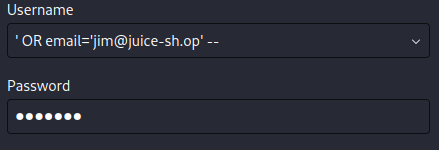
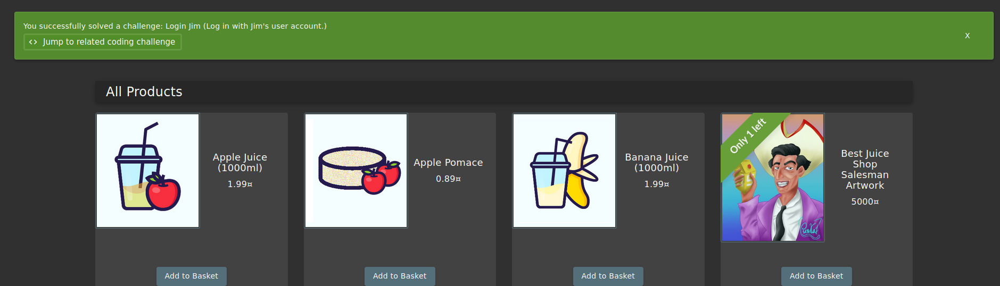

"
# OWASP Juice Shop – SQL Injection (Login as Specific User: Jim)

##  Objective
Exploit a SQL Injection vulnerability in the login functionality to authenticate as a specific user (`jim@juice-sh.op`) without knowing the password.

---

##  Vulnerability Description
The login mechanism is vulnerable to **SQL Injection**, allowing attackers to manipulate the query logic and authenticate as arbitrary users.

Unlike generic authentication bypass, this attack targets a **specific account**.

---

##  Affected Component
- Login endpoint: `/rest/user/login`
- SQL-based authentication logic

---

##  Payload Used

```sql
' OR email='jim@juice-sh.op' --
````

---

## 🔍 Exploitation Steps

### 1. Navigate to Login Page

Open the OWASP Juice Shop login interface.

---

### 2. Inject Payload

| Field    | Input                             |
| -------- | --------------------------------- |
| Email    | `' OR email='jim@juice-sh.op' --` |
| Password | `anything`                        |
the image below ilustrates the payload used




---

### 3. Resulting SQL Query

```sql id="h3s8zn"
SELECT * FROM users 
WHERE email = '' OR email='jim@juice-sh.op' -- ' 
AND password = 'anything';
```

---

### 4. Explanation

* `'` → Closes the original email string
* `OR email='jim@juice-sh.op'` → Forces query to match Jim’s account
* `--` → Comments out the password condition

👉 Effective condition:

```sql id="w2m9qp"
WHERE email='jim@juice-sh.op'
```

---

### 5. Result
as shown in the image below i was able to log in as jim



* Authentication is bypassed
* Application logs in as **Jim**
* No password required

---

##  Why This Works

This is a **targeted SQL Injection**, exploiting:

* Direct concatenation of user input into SQL queries
* No input sanitization or escaping
* Lack of prepared statements

---

##  Impact

* Unauthorized access to user accounts
* Potential exposure of personal data
* Privilege escalation depending on target account

---

##  Mitigation

###  Use Parameterized Queries

**Example (Node.js):**

```javascript id="7zv1ak"
db.query("SELECT * FROM users WHERE email = ? AND password = ?", [email, password]);
```

---

### Input Validation

* Sanitize or reject special characters (`'`, `--`, `;`)
* Use strict input validation rules

---

###  Use ORM Frameworks

* Sequelize
* Hibernate

---

###  Secure Authentication Logic

* Never trust client input directly
* Enforce server-side validation

---

## Severity

**High**

---

##  OWASP Classification

* OWASP Top 10: **A05:2025- Injection**

---

##  Conclusion

The application is vulnerable to SQL Injection, allowing attackers to authenticate as specific users by manipulating the SQL query. Using the payload `' OR email='jim@juice-sh.op' --`, an attacker can bypass authentication controls and gain unauthorized access to Jim’s account. This highlights the need for secure query handling through parameterized statements and proper input validation.

---

##  Tools Used

* Web Browser (manual testing)

---

