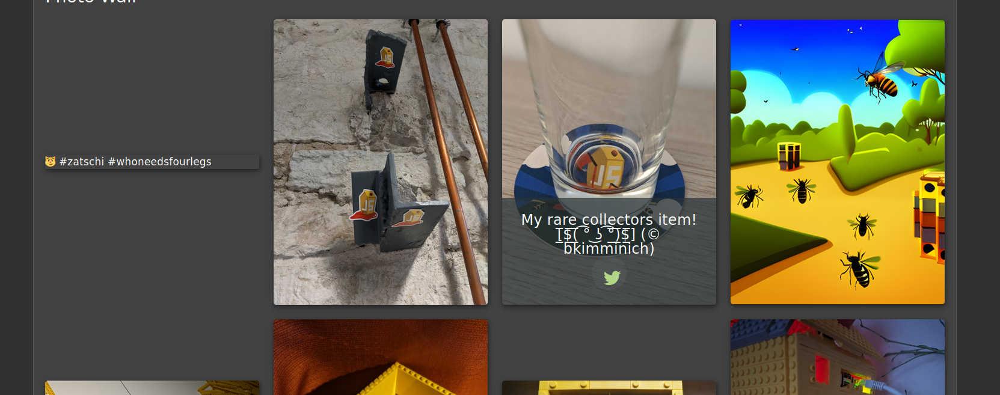
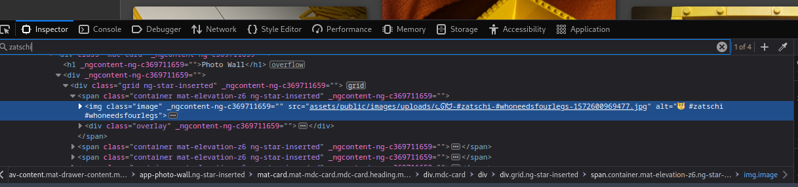
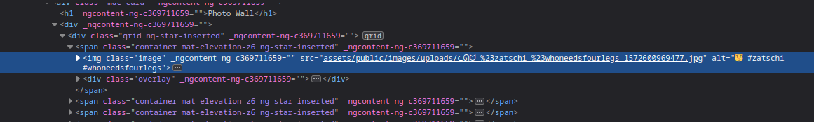
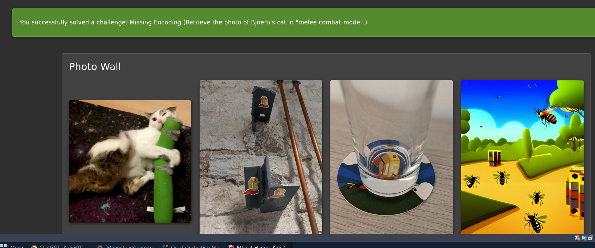

# OWASP Juice Shop – Improper Input Validation (Encoding Challenge)

## Challenge: Retrieve the hidden image of Bjoern's cat by fixing improper encoding.

---

## 🎯 Objective

Identify and fix an improperly encoded image URL on the Photo Wall in order to successfully load a hidden image.

---
## steps taken
1. Navigated to the Photo Wall.
2. Observed that one image was broken.
3. Inspected the image URL in the browser.
4. Noticed improper encoding in the URL.
5. Corrected the encoding manually.
6. Reloaded the image successfully.

##  Background

This challenge is part of OWASP Juice Shop and demonstrates a common web vulnerability:

> **Improper Input Validation due to incorrect URL encoding of special characters**

Modern web applications must properly encode special characters in URLs. Failure to do so can lead to broken functionality or even security vulnerabilities.

---

##  Initial Observation

While browsing the **Photo Wall**, one image appeared broken (not loading correctly) as shown in the image below:

Using browser Developer Tools (Inspect Element), the following image path was identified:

/assets/public/images/uploads/ᓚᘏᗢ-#zatschi-#whoneedsfourlegs-1572600969477.jpg

 ## problem identification
The issue lies in the use of the # character within the file name as shown in the image below

ᓚᘏᗢ-#zatschi-#whoneedsfourlegs-1572600969477.jpg
Why is this a problem?

In URLs:
is a fragment identifier
Anything after # is NOT sent to the server
Result

The server only receives:

ᓚᘏᗢ-

This leads to:

 Broken image , 
 Incorrect server request ,
 Fallback response (text/html)

## solution
To fix this issue, the # character must be URL encoded.

Encoding Rule
 %23
✅ Corrected URL
/assets/public/images/uploads/ᓚᘏᗢ-%23zatschi-%23whoneedsfourlegs-1572600969477.jpg

##execution

Paste the corrected URL into the browser using your developer tools as shown and press enter

http://localhost:3000/assets/public/images/uploads/ᓚᘏᗢ-%23zatschi-%23whoneedsfourlegs-1572600969477.jpg

The image should now load successfully as shown below

## Key Takeaways

- Always validate and encode user input properly.
- Improper encoding can break application functionality.
- Attackers can exploit encoding issues for injection attacks.